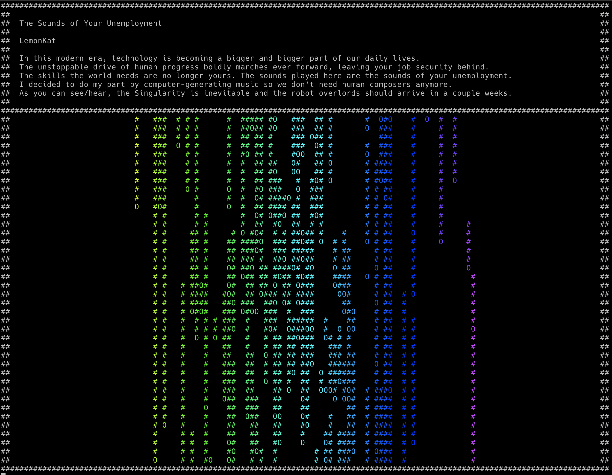

A set of programs for algorithmically generating music in the style of classical piano. First implemented using deterministic algorithms, now working on a transformer neural network that will hopefully sound better. 

It was originally titled ironically “The Sounds Of Your Unemployment” to imply that the livelihood of human musicians may be threatened, but as you can hear it’s “not quite” good.

The program includes a display where the notes fall from the top of the screen to the bottom before being played, all animated in the terminal using ANSI control codes.

The programs work by picking a random "seed" which is a sequence of MIDI notes from somewhere in the dataset, then repeatedly:
1. scanning through the dataset for all occurences of the seed
2. looking at which MIDI notes come after the seed
3. randomly picking a note from these notes and playing it
4. appending the picked note to the end of the seed, while chopping off the first note in the seed

To run:
1. install dependencies
2. compile `Generator.java`
3. add the [Maestro 3 dataset](https://magenta.tensorflow.org/datasets/maestro) to the data folder
4. run `python3 load.py data/maestro-v3.0.0 data/maestro.dat` to process the dataset
5. plug a MIDI device into your computer (and turn it on)
6. run `mido-ports` and find the name of the MIDI port corresponding to the device
7. run `java Generator path=data/maestro.dat | python3 inf_roll.py [port name]` where [port name] is the name of the MIDI device

Notes:
If your terminal isn't big enough for the graphics or doesn't support 24-bit TrueColor RGB, instead run `java Generator path=data/maestro.dat | python3 inf_play.py [port name]`

Required libraries:
1. tqdm
2. numpy
3. pygame
4. mido
5. PyTorch (for `neural_net/pt_nn_util.py`)
6. TensorFlow (for `neural_net/tf_nn_util.py`)